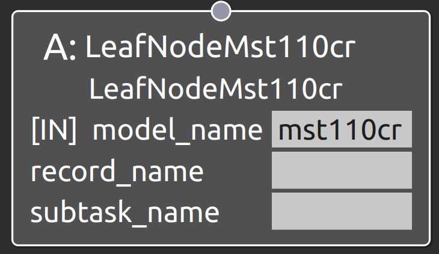

LeafNodeMst110cr
===================================

概要
-----------
共通制御信号対応クローラダンプMST110CRを操作するSubtask Nodeを接続するLeaf Node。
OperaSim-PhysX/AGX及び実機に対応。

  
.. raw:: html

.. raw:: html

     

入力ポート
-----------
- **model_name** : "mst110cr"と指定
- **record_name** : 接続するSubtask Nodeの仕様に合わせたパラメータデータのrecord_nameの値を指定
- **subtask_node** :  subtask_mst110cr_navigate_anywhere, subtask_mst110cr_follow_waypoints, subtask_mst110cr_navigate_through_poses, subtask_mst110cr_release_soilのいずれかを指定