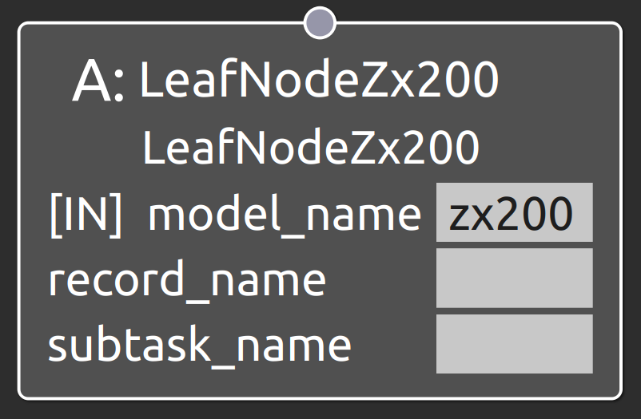

LeafNodeZx200
===================================

概要
-----------
共通制御信号対応バックホウZX200を操作するSubtask Nodeを接続するLeaf Node。
OperaSim-PhysX/AGX及び実機に対応。

  
.. raw:: html

.. raw:: html

     

入力ポート
-----------
- **model_name** : "zx200"と指定
- **record_name** : 接続するSubtask Nodeの仕様に合わせたパラメータデータのrecord_nameの値を指定
- **subtask_node** :  :doc:`subtask_zx200_change_pose <SubtaskZx200ChangePose>`, :doc:`subtask_zx200_excavate_simple <SubtaskZx200ExcavateSimple>`, :doc:`subtask_zx200_excavate_simple_plan <SubtaskZx200ExcavateSimplePlan>`, :doc:`subtask_zx200_release_simple <SubtaskZx200ReleaseSimple>`, :doc:`subtask_zx200_navigate_anywhere <SubtaskZx200NavigateAnywhere>`, :doc:`subtask_zx200_follow_waypoints <SubtaskZx200FollowWaypoints>`, :doc:`subtask_zx200_navigate_through_poses <SubtaskZx200NavigateThroughPoses>` のいずれかを指定