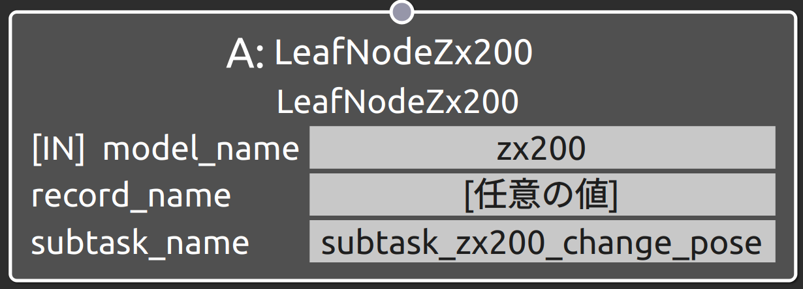
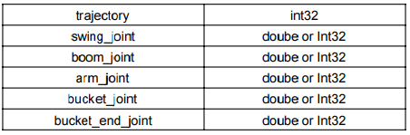
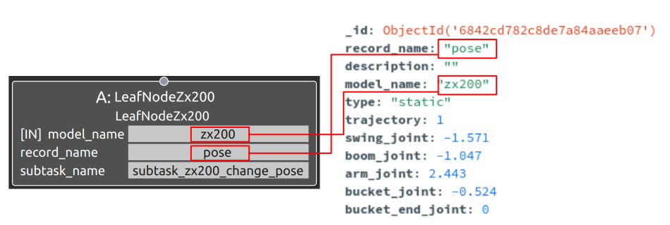

subtask_zx200_change_poseの概要
===================================

概要
-----------
共通制御信号対応バックホウZX200をマニピュレーション操作するSubtask Nodeの1つ。
バックホウの目標姿勢を指定し、現在姿勢からマニピュレーション操作を行う。
OperaSim-PhysX/AGX及び実機に対応。

使用方法
-----------
- **model_name** : "zx200"と指定
- **record_name** : 接続するSubtask Nodeの仕様に合わせたパラメータデータのrecord_nameの値を指定
- **subtask_node** :  "subtask_zx200_change_pose"と指定。

  
.. raw:: html

.. raw:: html

     

パラメータデータの仕様
-----------

ZX200を構成する各関節の角度をラジアン指定。

※_id, model_name. description, record_name等の共通仕様は除外

サンプル
-----------

**動作** : 目標姿勢（swing_joint：-1.571[rad],boom_joint：-1.047[rad], arm_joint：2.443[rad], bucket_joint：-0.524[rad], bucket_end_joint：0[rad]）に向けて移動 

