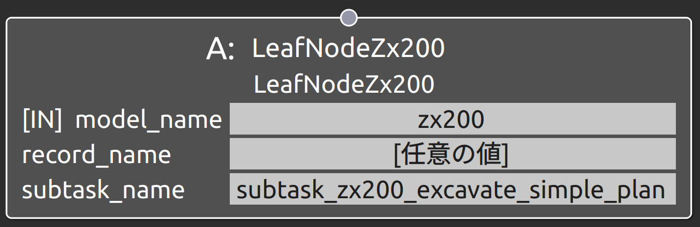
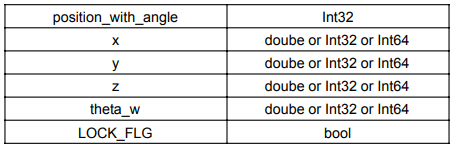
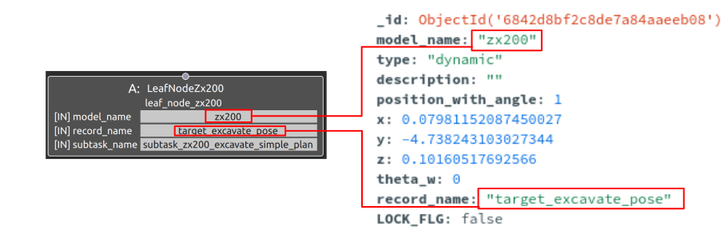

subtask_zx200_excavate_simple_planの概要
===================================

概要
-----------
共通制御信号対応バックホウZX200のマニピュレーション操作用のSubtask Nodeの1つ。
subtask_zx200_excavate_simpleと併用して用いられる。

subtask_zx200_excavate_simpleでは目標掘削位置が動作可能範囲から外れてしまった場合に
動作計画が失敗してしまう。Behavior TreeはSUCCESS・RUNNING・FAILUREの3種類の状態信号を
Subtak Nodeから受け取り可能であるものの、動作計画・実行のどちらのフェーズで何を理由に失敗したのか
Behavior Tree側で判断できない。このため、動作計画用のSubtask Nodeを別に用意することとした。
このノードが実行されると目標掘削位置に応じた動作計画が実行され、その結果に応じてSUCCESS・RUNNING・FAILURE
のいずれかの状態信号がBehavior Treeに返却される。また、もし動作計画に成功した場合には
その値をロックし、外部からの値の更新を受け付けないようにする。

OperaSim-PhysX/AGX及び実機に対応。

使用方法
-----------
- **model_name** : "zx200"と指定
- **record_name** : 接続するSubtask Nodeの仕様に合わせたパラメータデータのrecord_nameの値を指定
- **subtask_node** :  "subtask_zx200_excavate_simple_plan"と指定。

  
.. raw:: html

.. raw:: html

     

パラメータデータの仕様
-----------

各配列の要素番号NはN個目のウェイポイントの値として指定

※_id, model_name. description, record_name等の共通仕様は除外

サンプル
-----------

**動作** : Map座標基準のx軸方向1m, 2m, 3m地点を経由して移動。各地点ではbase_linkとmapの姿勢を合わせる。

