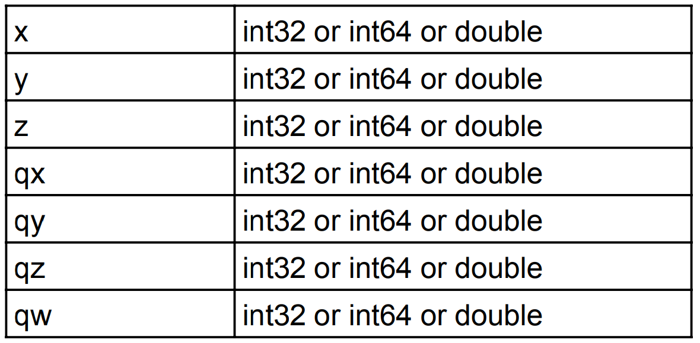
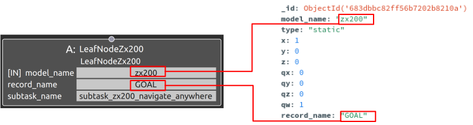

subtask_zx200_navigate_anywhereの概要
===================================

概要
-----------
共通制御信号対応バックホウZX200をナビゲーション操作するSubtask Nodeの1つ。
バックホウの目標位置姿勢を指定し、それに向かってナビゲーションを行う。
OperaSim-PhysX/AGX及び実機に対応。

使用方法
-----------
- **model_name** : "zx200"と指定
- **record_name** : 接続するSubtask Nodeの仕様に合わせたパラメータデータのrecord_nameの値を指定
- **subtask_node** :  "subtask_zx200_navigate_anywhere"と指定。

.. image:: ../images/SubtaskZx200NavigateAnywhere.png
   :alt: SubtaskZx200NavigateAnywhere
   :width: 400px
   :align: center  
  
.. raw:: html

.. raw:: html

     

パラメータデータの仕様
-----------

Map座標基準での目標位置姿勢を指定

※_id, model_name. description, record_name等の共通仕様は除外

サンプル
-----------

**動作** : Map座標基準のx軸方向1m地点へ移動。目標地点ではbase_linkとmapの姿勢を合わせる。

