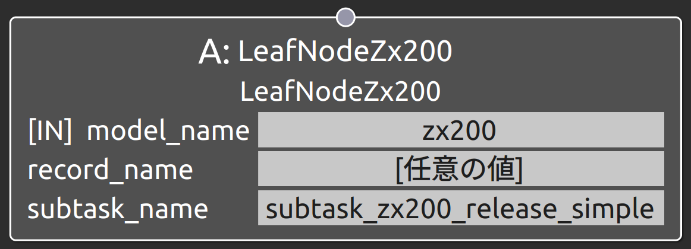
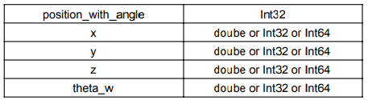
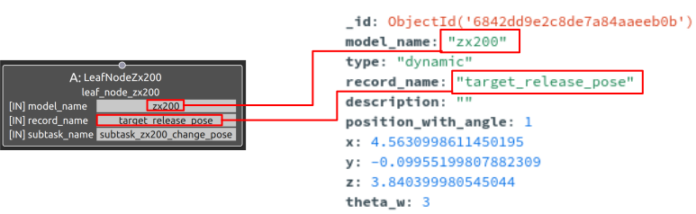

subtask_zx200_release_simpleの概要
===================================

概要
-----------
共通制御信号対応バックホウZX200をマニピュレーション操作するSubtask Nodeの1つ。
バックホウによる目標放土位置を指定し、そこに放土する。
OperaSim-PhysX/AGX及び実機に対応。

使用方法
-----------
- **model_name** : "zx200"と指定
- **record_name** : 接続するSubtask Nodeの仕様に合わせたパラメータデータのrecord_nameの値を指定
- **subtask_node** :  "subtask_zx200_release_simple"と指定。

  
.. raw:: html

.. raw:: html

     

パラメータデータの仕様
-----------

各配列の要素番号NはN個目のウェイポイントの値として指定

※_id, model_name. description, record_name等の共通仕様は除外

サンプル
-----------

**動作** : Map座標基準のx軸方向1m, 2m, 3m地点を経由して移動。各地点ではbase_linkとmapの姿勢を合わせる。

