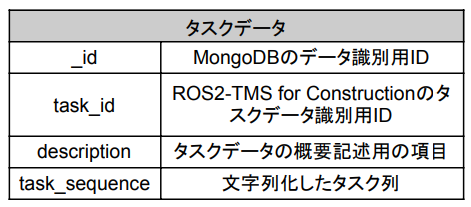
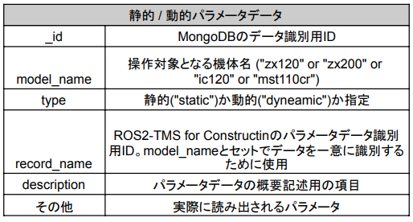
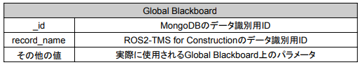

データベースの概要
===================================

ROS2-TMS for ConstructionのデータベースはMongoDBのrostmsdbデータベース上に構築されており、
特にタスク管理機構ではrostmsdbデータベース下のparameterコレクションとtaskコレクション下のデータを使用する。
各々の概要とそこに格納するデータの概要は以下に示すとおりである。

- **taskコレクション**

タスクデータを保管するコレクションである。ここに格納するデータの仕様は以下に示すとおりである。

.. raw:: html

     

なお、上記のタスクデータはこちらの手順にしたがってXML形式のタスク列から自動で生成される。

- **parameterコレクション**

パラメータデータを保管するためのコレクションである。ここには動的・静的パラメータや
Global Blackboardが格納される。各々の仕様は以下に示すとおりである。

.. raw:: html

     

.. raw:: html

     

なお、動的パラメータとはタスク実行中に外部から更新可能なパラメータを、静的パラメータとは
タスク実行時に指定された値がタスク終了時まで固定されているパラメータを指す。

