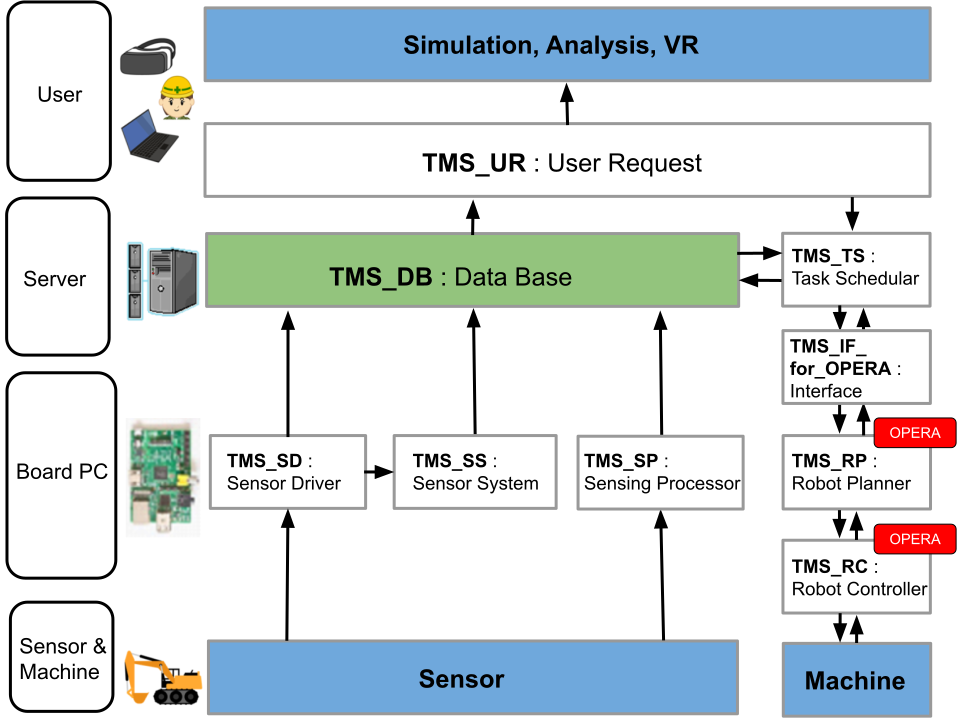

ROS2-TMS for Constructionの概要
===================================

Overview

ROS2-TMS for Constructionは九州大学 倉爪研究室で開発が進められている工事現場向けのCyber Physical System(CPS)です。
本システムでは工事現場に配置したセンサから様々な情報を収集し、以下の図に示すCyber Physical Systemの
構造に基づいて以下の手順で処理した上で、工事現場に配置された建設機械へと動作指令を送ることで自律化施工を行います。

.. image:: images/System_Concept.svg
   :alt: システムの概念図
   :width: 400px
   :align: center  
  
.. raw:: html

     

1. 工事現場の様々な箇所。自律移動建設機械に設置されたセンサからの情報を収集し、データベースに蓄える。ここで蓄えた情報を環境情報と呼ぶ (Measure)
2. 環境情報をもとにサイバー空間上にリアルタイムな工事現場を構築する。サイバー空間上の工事現場を分析し、建設機械が次に取るべき動作の計画を行う (Analyze,Plan)
3. 動作計画を実現するために建設機械に入力する信号を計算する (Control)

ROS2-TMS for Constructionでは以下に示す通り、各々の機能ごとにモジュールが分割されており、各々のモジュールが必要に応じて通信を行うことで
上記のシステムを成立させています。

  
.. raw:: html

     

各々のモジュールの説明は以下に示すとおりです。

- **Database Mobule (TMS_DB)** :   
  
  データベースへの入出力機能を担うモジュール
- **User Rqquest Module (TMS_UR)** : 
  
  ユーザからの入力を受け付けるモジュール
- **Task Scheduler Module (TMS_TS)**: 
  
  与えられたタスク(施工シナリオ)をタスクスケジューラによって処理するモジュール
- **Interface Module (TMS_IF_for_OPERA)** :   
  
  ROS2-TMS for ConstructionとOPERAを接続するモジュール
- **Robot Planning Module (TMS_RP) [OPERA]**:
  
  TMS_TSからの指令をもとに建設機械の動作計画を行うモジュール
- **Robot Controller Module (TMS_RC) [OPERA]** : 
  
  TMS_RPからの指令をもとに建設機械への入力信号を計算するモジュール
- **Sensing Processing Module (TMS_SP)** : 
  
  センシング処理した値を受け取り、TMS_DBへ送るモジュール
- **Sensor Driver Module (TMS_SD)** :
  
  センサからの値を受け取り、そのままTMS_DBへ送るモジュール
- **Sensor System Module (TMS_SS)** : 
  
  センサからの値を加工してからTMS_DBに送るモジュール

なお、現在ROS2-TMS for Constructionは大きく以下の2つのシステムに分け、開発が進められています。個々の機能については各々別ページで紹介します。

- **タスク管理機構** : 
  
  タスクスケジューラ（Behavior Tree）を使用し、工事現場の状態を逐次把握しつつ、その時々の現場の状態に合わせて自律移動建設機械を動作させる機能
- **OperaSim-VR** : 
  
  工事現場から得られる情報をもとにサイバー空間上にリアルタイムな工事現場を構築する機能

なお、ROS2-TMS for Constructionから操作可能な建設機械には以下のものが存在します。

.. image:: images/OPERA_machinaries.svg
   :alt: OPERA対応建設機械
   :width: 600px
   :align: center  
  
.. raw:: html

     

参考文献：

1. 

**Lumache** (/lu'make/) is a Python library for cooks and food lovers
that creates recipes mixing random ingredients.
It pulls data from the `Open Food Facts database <https://world.openfoodfacts.org/>`_
and offers a *simple* and *intuitive* API.

Check out the :doc:`usage` section for further information, including
how to :ref:`installation` the project.

.. note::

   This project is under active development.

Contents
--------

.. toctree::

   GettingStarted
   TaskManagementMechanism
   DataBase
   Tutorial
